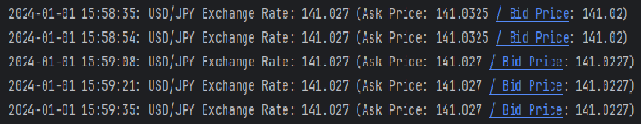
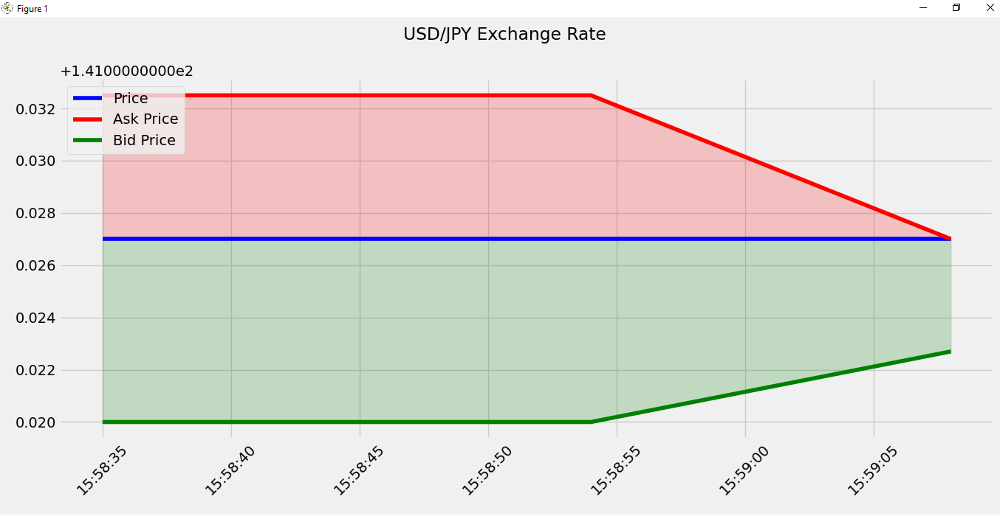
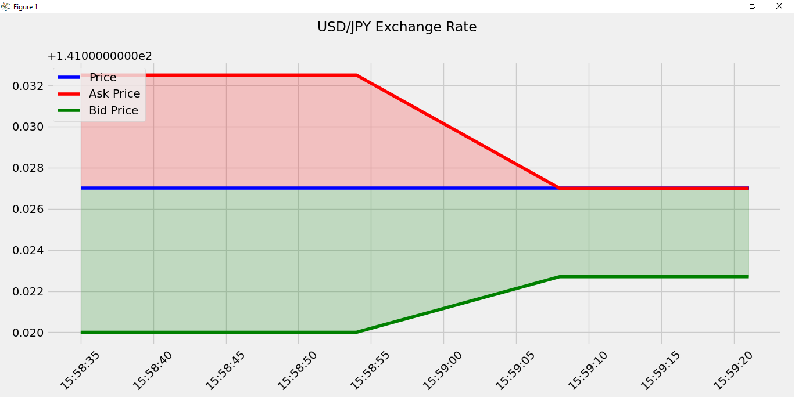

# Real-time Forex Data Streaming and Visualization Project

## Overview

This project utilizes Apache Flink to stream live data of USD/JPY exchange rates from the Alpha Vantage API. The streaming data includes the price, ask price, and bid price. The real-time data is then written to a CSV file, which is simultaneously read by a Python script. The Python script dynamically plots the live data, providing a visual representation of the exchange rate changes.

## Table of Contents

- [Prerequisites](#prerequisites)
- [Setup](#setup)
- [Project Structure](#project-structure)
- [Usage](#usage)
- [Dependencies](#dependencies)

## Prerequisites

Ensure you have the following installed:

- Apache Flink
- Python (3.x)
- Scala (2.12.x)
- Intellij
- Required Python packages (matplotlib, pandas, etc.)
- Alpha Vantage API key (get it from [Alpha Vantage](https://rapidapi.com/alphavantage/api/alpha-vantage))

## Setup

1. Open Intellij

2. Clone the repository

3. Install Python dependencies:
    ```bash
   pip install requirements.txt

4. Run **src/main/scala/Main.scala**
5. Run **plot.py** to see visualization of live data

## Project Structure

- **src/main/scala/ExchangeRateSource.scala**: Flink Source Function that downloads data from the alphavantage API 
- **src/main/scala/CsvSinkFunction.scala**: Flink sink function that writes live data to csv file
- **src/main/scala/Record.scala**: case class that represents one record of data
- **plot.py**: python script to plot the live data

## Usage




## Dependencies
- Python dependencies are in the requirements.txt file
- Scala dependencies are in the build.sbt file
